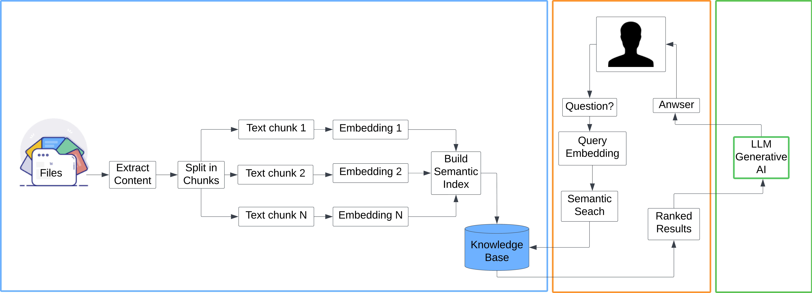

# **RAG (Retrieval-Augmented Generation)**

Este projeto implementa um sistema de **Geração Aumentada por Recuperação (RAG)**, que combina **Modelos de Linguagem Grande (LLMs)** com dados externos para fornecer respostas precisas, atualizadas e contextuais.

---

## **Descrição**

Um pipeline RAG é projetado para responder perguntas ao recuperar informações de fontes externas e processá-las com um LLM. Este projeto utiliza o **LangChain**, uma biblioteca voltada para a criação de fluxos de trabalho com LLMs, para construir o pipeline.



### **Etapas do Pipeline**

1. **Ingestão de Dados**  
   O processo começa com a coleta de dados de diversas fontes, como arquivos de texto, PDFs e páginas da web. O LangChain oferece ferramentas específicas para isso, incluindo:
   - **TextLoader**: Carrega arquivos de texto.
   - **PyPDFLoader**: Lê dados de documentos PDF.

2. **Transformação de Dados**  
   Após a ingestão, os dados são preparados para uso. Uma etapa comum é a divisão dos documentos em trechos menores, devido à limitação do tamanho de contexto dos LLMs.  
   Ferramenta recomendada: **RecursiveCharacterTextSplitter**.

3. **Incorporação de Vetores**  
   Os dados são convertidos em representações vetoriais usando métodos como **OpenAIEmbeddings** ou **OllamaEmbeddings**. Esses vetores são armazenados em repositórios especializados, como:
   - **FAISS**: Rápido e eficiente, ideal para busca de vetores similares, mas exige configuração detalhada.

### **Benefícios**
- **Respostas atualizadas** com dados externos.
- **Menor dependência de modelos gigantes**, já que o conhecimento é buscado dinamicamente.
- **Versatilidade de aplicação** em áreas como suporte ao cliente, pesquisa acadêmica e análise jurídica.

---

## **Funcionalidades**
- Busca em bases de dados externas com motores vetoriais (e.g., FAISS, Pinecone, Weaviate).
- Integração com LLMs como GPT, LLaMA ou modelos disponíveis no Hugging Face.
- Recuperação eficiente para encontrar documentos relevantes com embeddings.
- Geração dinâmica de respostas com base nos dados recuperados.

---

## **Requisitos**
- **Python 3.8+**
- Dependências principais:
  - `transformers`
  - `faiss-cpu` (ou outro motor vetorial)
  - `sentence-transformers`
  - `torch`
- Veja mais detalhes em `requirements.txt`.

---

## **Instalação**
1. Clone o repositório:
   ```bash
   git clone https://github.com/AertySantos/llama_rga.git
   cd llama_rag
   ```
2. Faça o download do modelo, para a pasta models:
   ```
[Modelo](https://huggingface.co/TheBloke/Llama-2-13B-chat-GGUF)
   
   ```


2. Crie um ambiente virtual com conda e ative-o. Primeiro, certifique-se de ter o conda instalado. Em seguida, execute o seguinte comando:
   ```
   conda create -n llms python=3.11 -y && source activate llms
   ```

3. Execute o seguinte comando no terminal para instalar os pacotes Python necessários:
   ```
   pip install -r requirements.txt
   ```

4. Configure os dados:
   - Adicione seus arquivos no diretório `data/`.
   - Gere os embeddings:
     ```bash
     python create_embeddings.py
     ```

---

## **Como usar**
1. Inicie o servidor:
   ```bash
   python app.py
   ```

2. Acesse a interface ou envie requisições para gerar respostas baseadas nos dados fornecidos.

---

## **Estrutura do Projeto**
```plaintext
├── data/                 # Diretório para arquivos de dados
├── embeddings/           # Armazenamento de embeddings gerados
├── models/               # Modelos e configurações
├── app.py                # Script principal para execução
├── create_embeddings.py  # Geração de embeddings
├── requirements.txt      # Lista de dependências
├── README.md             # Documento de instruções
```

---

## **Exemplo de Uso**

- **Entrada**: Uma pergunta feita pelo usuário.  
- **Processo**: O pipeline recupera informações relevantes, processa os dados com o LLM e retorna uma resposta clara e contextualizada.  

---

## **Contribuições**
Contribuições são bem-vindas! Sinta-se à vontade para abrir issues ou enviar pull requests para aprimorar o projeto.

---


Precisa de ajustes adicionais? Estou à disposição! 🚀
